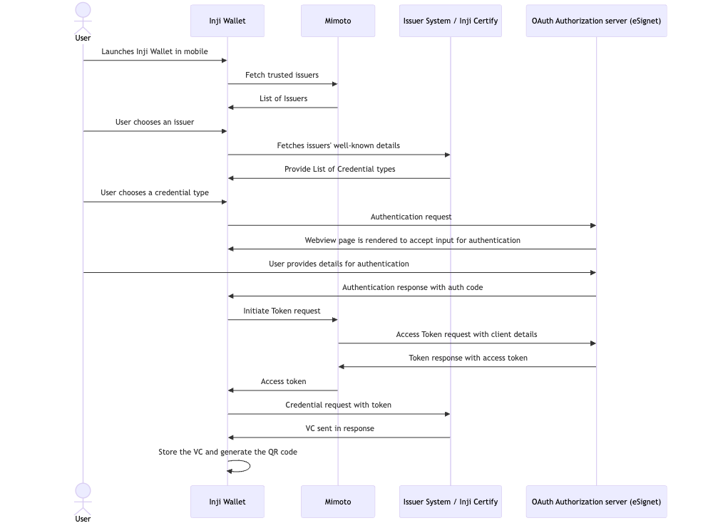

# **Understanding the workflow**

### **Inji Wallet**

- The user installs the application on Android or iOS device.
  - Application link is available in our sandbox env https://collab.mosip.net/
- After installation, user will be asked to select unlock method as passcode or biometric to add security to the application
- After selecting unlock method, user will be navigated to Home screen.
- After this, user can download the verifiable credentials for trusted issuers configured in mimoto.
  - Mimoto maintains a list of trusted issuers and that is sourced from [mimoto-issuers-configuration](https://github.com/mosip/inji-config/blob/collab/mimoto-issuers-config.json)
  - Use can tap on plus icon on home screen. It will fetch the trusted issuer list from mimoto and display it.

### **Selection of Issuer and credential type:**

- The users can select an Issuer from the list of trusted issuers
- On clicking the issuer, user will be redirected to credential Types, where user will be displayed with list of credentials supported by the selected issuer.
- Credential Types of the issuers are sourced from the issuers wellknown **"/.well-known/openid-credential-issuer"**
- The users can select a credential type from the available options provided by the issuers.

**Sequence Diagram for the Inji Wallet is mentioned here**

### **Authorization**

- When the user selects any credential type, user is redirected to the authorization page for that specific issuer.
- This authorization page is managed by `OAuth Authorization server (eSignet)` and will be rendered in webview inside Inji App.
  - User will be asked to provide details for authorization.
- Once authorization is successful, authorization server return the **"authorizationCode"**
- Inji Wallet sends the authorization code to authorization server through Mimoto to perform the client assertions.
- Once authorized, authorization server issues token response, which include **access_token**.
- The "access_token" will be used to download the credential through VCI.

### **VC Issuance**

- Inji wallet generates a keypair using secure-keystore module and signs the credential request.
- It invokes the issuer's VCI endpoint and send this credential request along with access token issued during authorization.
- Inji Wallet receives the credential back, displays it and stores in internal storage to support offline transfer.

### \*\*Display and Store Credential

- Inji Wallet uses the credential response and applies the issuers wellknown display properties to modify the template text and background colour.
- It also uses order field in wellknown to render the fields in the same order.

### **Supported QR Codes**

- Inji Wallet uses Pixelpass libary to generate the QR to emded complete VC within the QR.
- This library supports the VC without biometric/face

### **Offline BLE Sharing**

- Inji Wallet use Tuvali libary to support offline BLE sharing with relying parties or verifiers.
- The user can tap on kebab popup icon (three dots) and initiate the flow with share or share with selfie option.
