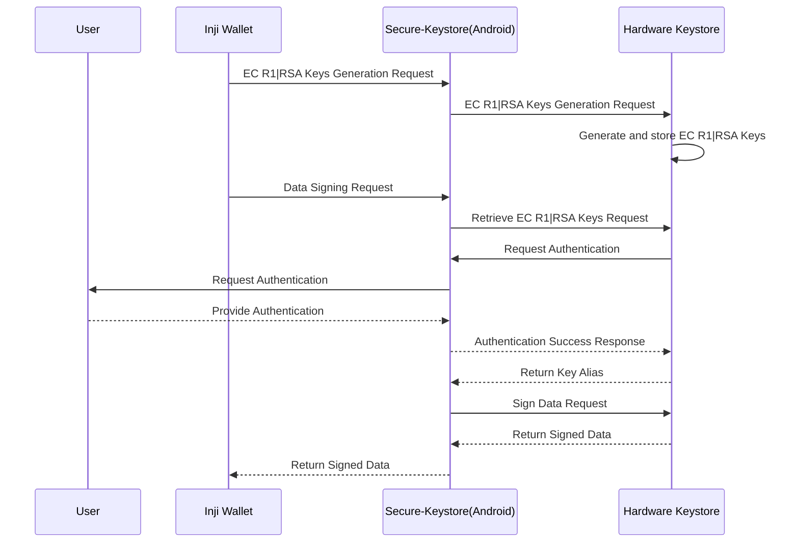
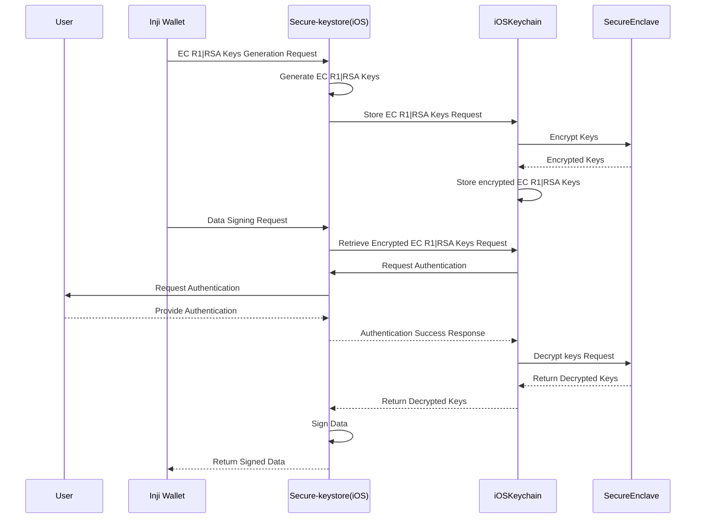
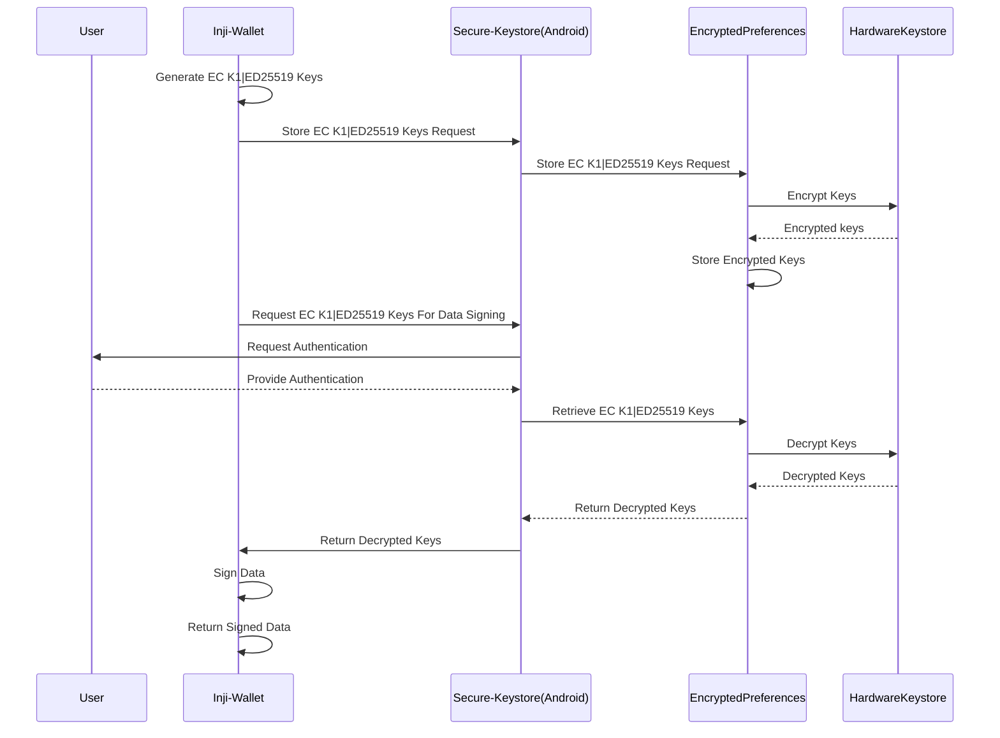
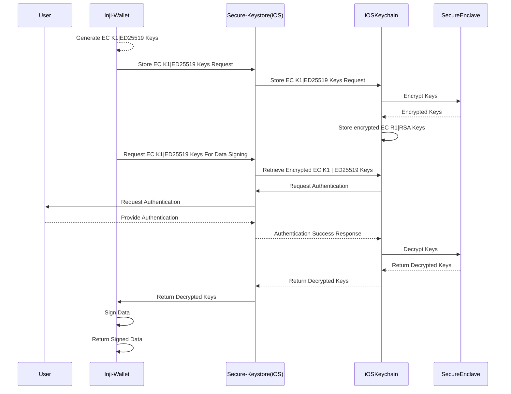

# Inji Wallet - Key Management Feature

## Overview
The Inji Wallet supports **RSA, EC R1, EC K1, and ED** keys for signing operations. This document provides a detailed breakdown of the key management process for each key type and its interaction with different system components.

## Supported Key Types 
- RSA-2048
- EC R1
- EC k1
- Ed25519

---

##  Key Management Flow: 

***RSA & EC R1***

***Android Flow***

***iOS Flow***

The RSA and EC R1 keys are directly supported by the android hardware-keystore, hence all cryptographic operations like signing take place there itself.
For iOS we make use of keyWrapping to store the keys safely in keychain, and use them for necessary operations.

---

***EC K1 & ED***

***Android Flow***

***iOS Flow***

The EC K1 and Ed25519 keys are not directly supported by hardware keystore in android or iOS, hence in both platforms we make use of secure storage areas; encryptedPreferences in android, keychain in ios, with the help of key wrapping.

---
