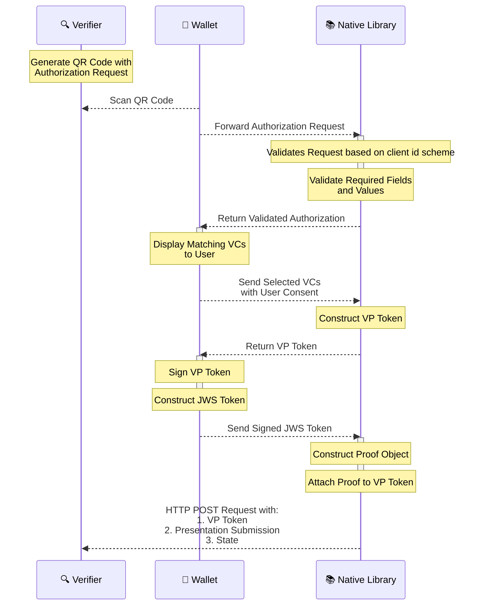

# OpenID4VP - Online Sharing

The Inji Wallet supports OpenID4VP specification draft 21 and this document provides a comprehensive overview of the process of sending a Verifiable Presentation to
Verifiers who request them online. It adheres to the OpenID4VP [specification](https://openid.net/specs/openid-4-verifiable-presentations-1_0-21.html) which outlines the standards for
requesting and presenting Verifiable Credentials.

## Specifications supported
- The implementation follows OpenID for Verifiable Presentations - draft 21. [Specification](https://openid.net/specs/openid-4-verifiable-presentations-1_0-21.html).
- Below are the fields we expect in the authorization request based on the client id scheme,
  - Client_id_scheme is **_pre-registered_**
    * client_id
    * client_id_scheme
    * presentation_definition/presentation_definition_uri
    * response_type
    * response_mode
    * nonce
    * state
    * response_uri
    * client_metadata (Optional)

  - Client_id_scheme is **_redirect_uri_**
    * client_id
    * client_id_scheme
    * presentation_definition/presentation_definition_uri
    * response_type
    * nonce
    * state
    * redirect_uri
    * client_metadata (Optional)
    
  - **_Request Uri_** is also supported as part of this version.
  - When request_uri is passed as part of the authorization request, below are the fields we expect in the authorization request,
     * client_id
     * client_id_scheme
     * request_uri
     * request_uri_method
   
  - The request uri can return either a jwt token/encoded if it is a jwt the signature is verified as mentioned in the specification.
  - The client id and client id scheme from the authorization request and the client id and client id scheme received from the response of the request uri should be same.
- VC format supported is Ldp Vc as of now.

**Note** : The pre-registered client id scheme validation can be toggled on/off based on the optional boolean which you can pass to the authenticateVerifier methods shouldValidateClient parameter. This is false by default.

## Functionalities
##### Authorization Request handling:
- The Verifier will generate a QR code with authorization request.
- Wallet scans the QR code to get the Authorization request and sends the authorization request to the library along with the trusted verifiers and boolean to validate the client.
- Library decodes and parse the Verifier's encoded Authorization Request received from the Wallet.
   **Note** : When request_uri is present in the request, the actual authorization request is retrieved by making a request to the request_uri.
- Authenticates the Verifier based on the client id scheme in the Authorization request and return the valid Authorization request to the wallet.
   **Note** : Only when the client id scheme is pre-registered the validation can be toggled on/off based on the boolean.

##### Credential selection and sending response:
- Wallet reads the authorization request and sends the list of matching verifiable credentials to the library.
- Library receives the list of verifiable credentials(VC's) from the Wallet which are selected by the end user based on the credentials requested.
- Constructs the verifiable presentation and send it to wallet for generating Json Web Signature (JWS).
- Wallet signs the verifiable presentation and sends the JWS along with the details to the library.
- Library receives the signed Verifiable presentation and sends a POST request with generated vp_token and presentation_submission to the Verifier response_uri endpoint.

