# OpenID4VP - Online Sharing

This library enables consumer applications (mobile wallet) to share users Verifiable Credentials with
Verifiers who request them online. It adheres to the OpenID4VP [specification](https://openid.net/specs/openid-4-verifiable-presentations-1_0-21.html) which outlines the standards for
requesting and presenting Verifiable Credentials.

### Specifications supported
- The implementation follows OpenID for Verifiable Presentations - draft 21. [Specification](https://openid.net/specs/openid-4-verifiable-presentations-1_0-21.html).
- Below are the fields we expect in the authorization request,
    * client_id
    * presentation_definition
    * response_type
    * response_mode
    * nonce
    * state
    * response_uri
    * client_metadata (Optional)
- Request Uri is not supported as of now.
- client_id_scheme is not mandatory. By default, we are validating the client based on pre-registered client id scheme, if passed as part of the authorization request it is ignored.
- Same device flow is not supported, Hence redirect_uri is not supported in the authorization request. If passed as part of the authorization request it is ignored.
- VC format supported is Ldp Vc as of now.

**Note** : The pre-registered client id scheme validation can be toggled on/off based on the optional boolean which you can pass to the authenticateVerifier methods shouldValidateClient parameter. This is false by default.

## Functionalities
- Decode and parse the Verifier's encoded Authorization Request received from the Wallet.
- Authenticates the Verifier using the received clientId and returns the valid Presentation Definition to the Wallet.
- Receives the list of verifiable credentials(VC's) from the Wallet which are selected by the end user based on the credentials requested as part of Verifier Authorization request.
- Constructs the verifiable presentation and send it to wallet for generating Json Web Signature (JWS).
- Receives the signed Verifiable presentation and sends a POST request with generated vp_token and presentation_submission to the Verifier response_uri endpoint.

```mermaid
sequenceDiagram
    participant Verifier as 🔍 Verifier
    participant Wallet as 📱 Wallet
    participant Library as 📚 Native Library
    
    Note over Verifier: Generate QR Code with<br/>Authorization Request
    Wallet -->> Verifier: Scan QR Code
    Wallet -->> Library: Forward Authorization Request

    activate Library
    Note over Library: Validate Request against:<br/>1. Client ID<br/>2. Response URI<br/>3. Trusted Verifiers
    Note over Library: Validate Required Fields<br/>and Values
    deactivate Library
    Library-->>Wallet: Return Validated Authorization
    

    activate Wallet
    Note over Wallet: Display Matching VCs<br/>to User
    deactivate Wallet
    
    Wallet-->>Library: Send Selected VCs<br/>with User Consent
    Library-->>Library: Construct VP Token
    Library-->>Wallet: Return VP Token
    
    activate Wallet
    Note over Wallet: Sign VP Token
    Note over Wallet: Construct JWS Token
    deactivate Wallet
    Wallet-->>Library: Send Signed JWS Token
    
    activate Library
    Note over Library: Construct Proof Object
    Note over Library: Attach Proof to VP Token
    deactivate Library
    
    Library-->>Verifier: HTTP POST Request with:<br/>1. VP Token<br/>2. Presentation Submission<br/>3. State
```

