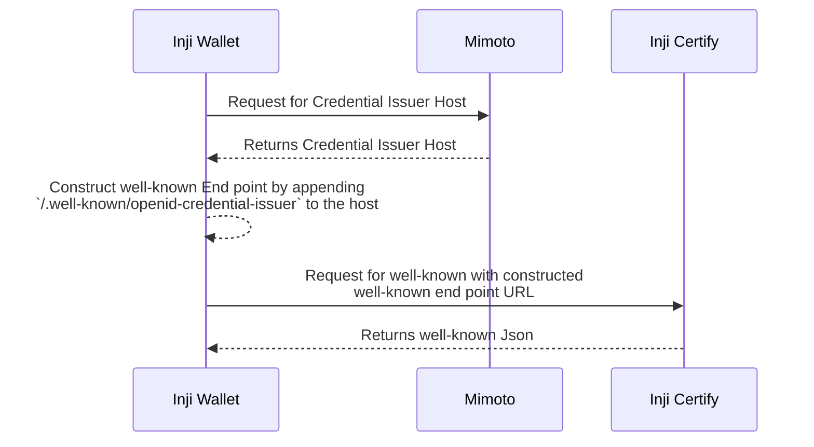

# Well-Known Discovery

Inji Wallet fetches well-known response directly by hitting the endpoint url constructed using Credential Issuer by appending `/.well-known/openid-credential-issuer`

## Well-Known discovery flow

- The implementation follows OpenID for Verifiable Credential Issuance. [Specification](https://openid.net/specs/openid-4-verifiable-credential-issuance-1_0.html#name-credential-issuer-metadata-).
- Steps involved in the Well-Known discovery from Inji Wallet,
  - Inji wallet sends request to Mimoto for fetching Issuers Configurations.
  - Each Issuers has the parameter `credential_issuer_host`.
  - Once Issuers Configurations are fetched, append `/.well-known/openid-credential-issuer` to `credential_issuer_host` and construct the Well-Known end point.
  - Invoke the End point URL directly from Inji Wallet to get the Well-Known Response which will be in json format.

