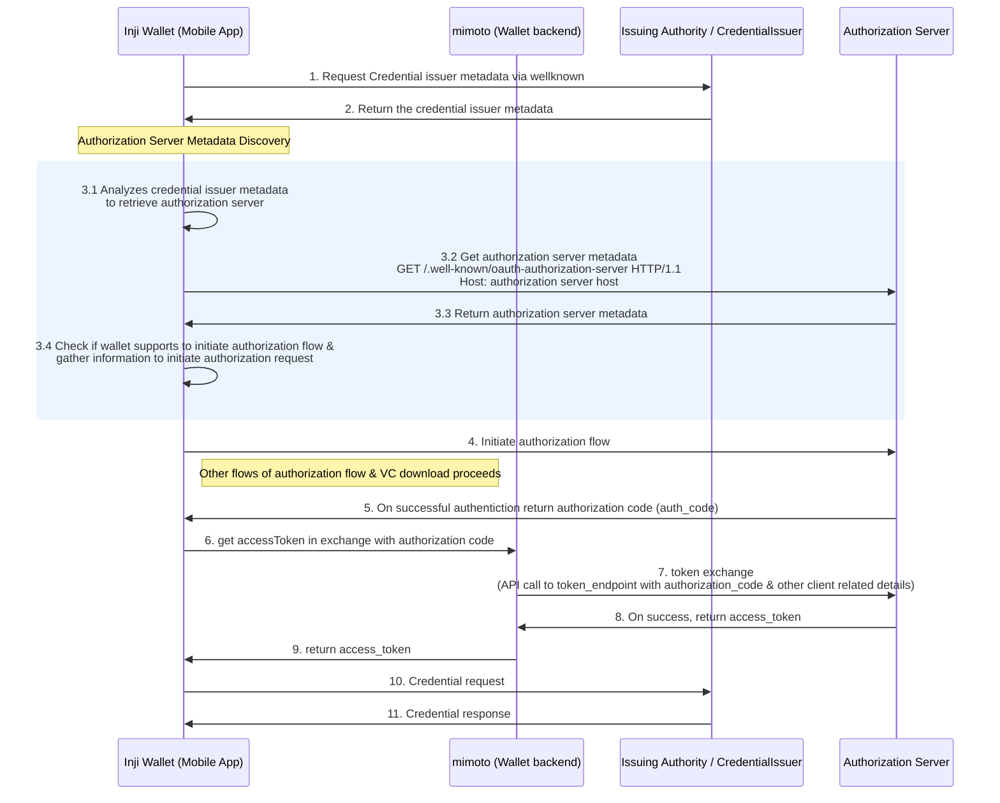

## VC Download Flow with Authorization Server Wellknown Discovery

This document outlines the process of initiating the authorization flow during the Verifiable Credential (VC) download, utilizing the Authorization Server's well-known metadata. The flow adheres to OpenID4VCI specifications to ensure compliance and interoperability.

## Introduction to Authorization Server Metadata Discovery

- Credential Issuer metadata includes an optional `authorization_servers` property, which specifies the authorization servers the issuer relies on for authorization purposes.

- From a wallet's perspective, the `authorization_servers` property plays a crucial role in identifying the supported authorization servers associated with the Credential Issuer. This enables the wallet to determine the appropriate authorization mechanisms, ensuring seamless and compliant credential issuance as per the OpenID4VCI specification.


## VC Download Flow with Authorization Server Metadata Discovery - Sequence Diagram

**Actors Involved**
1. Inji Wallet (Mobile App)
2. Issuing Authority / Credential Issuer
3. Authorization Server
4. mimoto (Wallet backend)




## Retrieving Authorization Server Metadata

Authorization server metadata is derived from the `authorization_servers` property of the credential issuer metadata. This process enables the wallet to identify and interact with the appropriate authorization server for credential issuance, in accordance with the OpenID4VCI specification.

#### Steps Involved:

1. **Fetch Credential Issuer Metadata** – Retrieve the metadata associated with the credential issuer.
2. **Extract the `authorization_servers` Property** – Identify the list of authorization servers supported by the issuer.
3. **Select an Authorization Server** – The first entry from the `authorization_servers` array is selected as the default authorization server. (As per OpenID4VCI, when multiple entries exist, each should be iterated and checked for compatibility with the wallet. This step is currently not implemented.)
4. **Discover Authorization Server Metadata** – Perform a well-known discovery request to obtain the metadata of the selected authorization server.


#### Authorization Server Metadata Discovery Request

A well-known endpoint is used to retrieve metadata:

```http request
GET /.well-known/oauth-authorization-server HTTP/1.1
Host: authorization-server-host
```

Sample Authorization Server Metadata Response

```http request
HTTP/1.1 200 OK
Content-Type: application/json

{
      "issuer": "https://server.example.com",
      "authorization_endpoint": "https://server.example.com/authorize",
      "token_endpoint": "https://server.example.com/token",
      "jwks_uri": "https://server.example.com/jwks.json",
      "token_endpoint_auth_methods_supported": ["private_key_jwt"],
      "token_endpoint_auth_signing_alg_values_supported": ["RS256"],
      "scopes_supported":["profile", "email", "phone"],
      "response_modes_supported": ["query"],
      "grant_types_supported": ["authorization_code"],
      "response_types_supported": ["code"]
 }
```
   
## Assessing Wallet Compatibility with Authorization Server for Authorization Flow in VC download

To determine whether the wallet supports the authorization server's requirements and can proceed with the authorization flow, it validates and processes the authorization server metadata in compliance with the OpenID4VCI specification.

#### Steps Involved:

1. **Validate Supported Grant Types** – Verify that the `grant_types_supported` field in the authorization server metadata includes a grant type that the wallet supports. (Currently, the wallet supports only the authorization_code grant type.)
2. **Extract the Authorization Endpoint** – Retrieve the `authorization_endpoint` from the authorization server metadata, which will be used to initiate the authorization process.
3. **Initiate the Authorization Flow** – Begin the authentication process with the authorization server using the retrieved endpoint.
4. **Proceed with Credential Retrieval** – Once authorization is successfully completed, the wallet continues with the subsequent steps of the VC download process.

### Handling errors in wellknown discovery
To ensure a smooth authorization flow, the wallet must handle potential errors that may arise during the well-known discovery process. Below are key error handling scenarios:

##### 1. Unsupported Grant Type
- If the grant_types_supported field in the authorization server metadata does not include a grant type supported by the wallet (authorization_code), the authorization process is terminated. 
- The user is notified with an appropriate error message indicating that the wallet is incompatible with the authorization server.
##### 2. Network and API Errors
- Errors encountered while making requests to the authorization server’s well-known endpoint (e.g., network failures, timeouts, or invalid responses) are handled gracefully.
- Appropriate error handling mechanisms, such as retry logic or error display, are implemented to inform the user.

## Aligning with OpenID4VCI Specification

The implementation adheres to OpenID4VCI Draft 13 and RFC 8414 (OAuth 2.0 Authorization Server Metadata) to ensure standardized discovery and interaction with authorization servers. 
