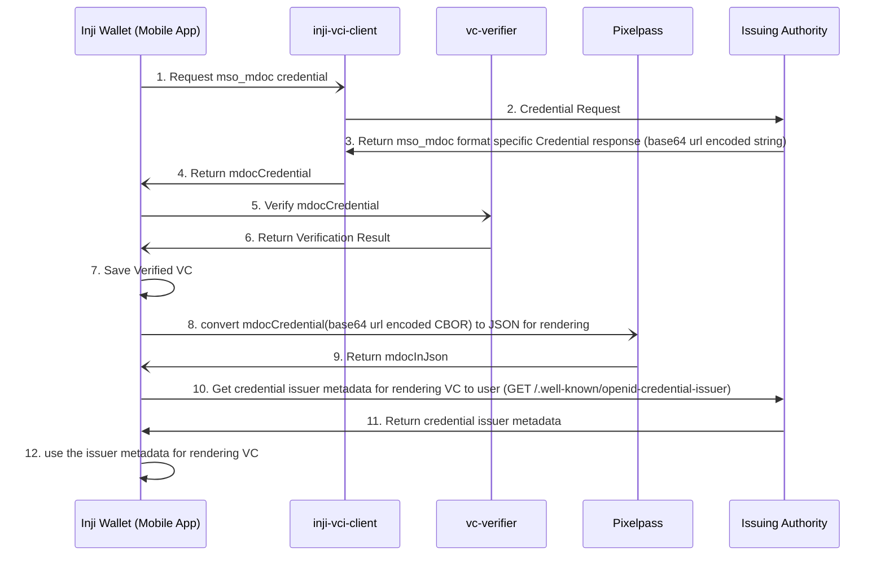

## Support of credential format mso_mdoc

This document provides a comprehensive overview of the process for downloading and rendering an mDoc, adhering to the OpenID4VCI specification. It details the necessary steps to retrieve, validate, and present credentials in the mso_mdoc format.
### Actors involved
1. Inji Wallet
2. Issuing authority
3. _inji-vci-client_ (Library for downloading credential)
4. _vc-verifier_ (library for verification of downloaded VC)
5. _pixelpass_ (In case of mdoc, this library for converting base64 url encoded mdoc credential to JSON for rendering purpose)

###  Sequence diagram - download & view mso_mdoc credential format VC



#### Steps involved
##### 1. Make credential request

Establish communication with the _inji-vci-client_ to submit a credential request to the issuing authority.

````
{
   "format": "mso_mdoc",
   "doctype": "org.iso.18013.5.1.mDL",
   "claims": {
      "org.iso.18013.5.1": {
         "given_name": {},
         "family_name": {},
         "birth_date": {}
      },
   },
   "proof": {
      "proof_type": "jwt",
      "jwt": "eyJraWQiOiJkaWQ6ZXhhbXBsZ...KPxgihac0aW9EkL1nOzM"
   }
}
````
##### 2. Receive the credential response
The _inji-vci-client_ submits the credential request to the issuing authority. Once the response is received, it is returned to the Wallet.

```
{  
	"credential": "<base-64-url-encoded-cbor-data>"  
}  
```
##### 3. Perform vc verification

After obtaining the credential from the issuing authority through the _inji-vci-client_ library, a verification process ensures that the issued Verifiable Credential (VC) remains unaltered. For credentials in the mso_mdoc format, the following validations are performed using the _vc-verifier_ library:

1. [x] Confirm the credential has not been tampered with. (Cryptographic Signature/Hash Verification)
2. [x] Issuing Country Validation.
3. [x] Document Type Check.
4. [x] Confirms the credential is within its valid usage period. (Validity Information Check)
5. [x] Verifies the integrity of the certificate chain to ensure that the credential is issued by a legitimate and authorized issuer. (Document Signer certification validation) [currently not implemented]

##### 4. Rendering of mso_mdoc VC

- In the case of an mso_mdoc format Verifiable Credential (VC), the issuer provides the credential as Base64-encoded CBOR data. The Wallet interacts with the _pixelpass_ library to convert this encoded CBOR data into JSON format, which is then used for rendering the credential.
- The processed credential is not stored in persistent storage or shared via Bluetooth to optimize storage efficiency and transmission size. Instead, it is maintained only within the state machine context, ensuring that repeated interactions with PixelPass are avoided for rendering.
- Once the processed VC is obtained, the issuer's well-known configuration is used to determine how the credential should be displayed, including labeling and field ordering.

- #####  VC Detail View Rendering:
  - Field Labels:
  The labels displayed for each field are derived from the Credential Issuer's metadata claims under the display attribute.
  Reference: OpenID4VCI Spec - Credential Issuer Metadata. 
  - Field Ordering:
    - As per OpenID4VCI Draft 13, the order property in the issuer’s well-known configuration defines the order of fields to be displayed.
    This property contains an array of claims.display.name values, specifying the sequence in which the Wallet should present the fields. 
    -   Example:
       ` org.iso.18013.5.1\~given_name` (` Format: {namespace}\~{claim-value-name}`)

This structured approach ensures that the credential is rendered accurately and efficiently while maintaining a lightweight storage and transmission footprint.
