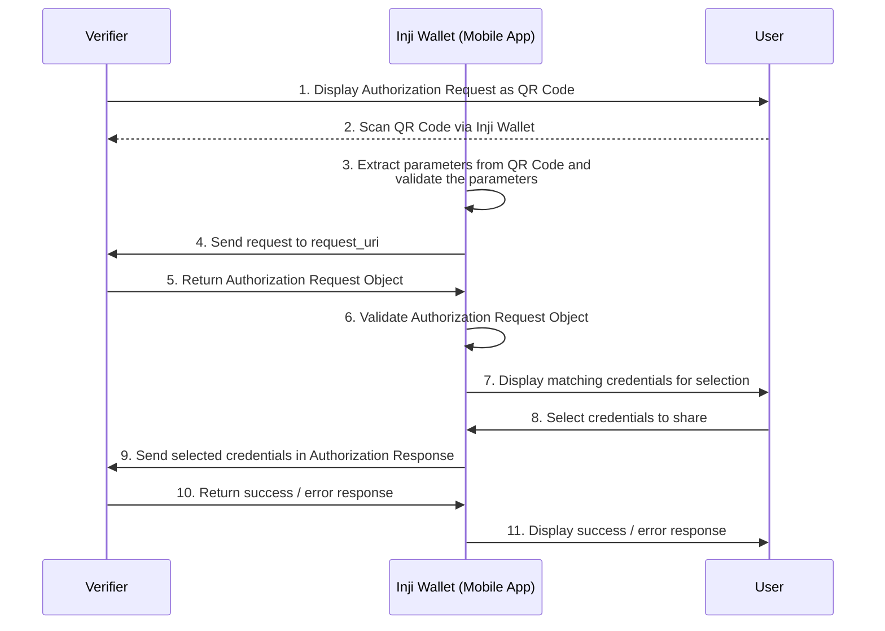

# OpenID4VP - Obtain Authorization Request by Reference Support

## Introduction

The OpenID4VP specification allows the Verifier to send Authorization Request by reference. This uses the paramters `request_uri` and `request_uri_method` (Optional) to send the authorization request as a URL reference. This feature is useful for reducing the size of the URL and improving security by not exposing sensitive information.

## Actors involved
1. Inji Wallet
2. Verifier
3. _inji-openid4vp_ (Library for Online Sharing of Verifiable Presentations) - This is consumed by the wallet to achieve the flow.

## Sequence Diagram - Obtain Authorization Request by Reference

#### Steps involved

The implementation of this feature involves the following steps:
1. The Verifier displays the Authorization Request to the End-User as a QR Code with parameters like `client_id`, `request_uri` and optionally `request_uri_method`, `client_id_scheme`.
2. The Wallet scans the QR Code and extracts the parameters and validates the parameters in the request. 
   - In case of `client_id_scheme` being `pre_registered`, the Wallet also checks if the `request_uri` is available with its trusted Verifiers list for privacy considerations along with checking if the `client_id` is available in the trusted Verifiers list.
   - For other schemes, the usual validation is done based on the `client_id_scheme` and the `client_id` value.
3. The Wallet then sends a request to the Verifier's `request_uri` value that is provided in the QR Code.
   - If `request_uri_method` is not provided, the Wallet uses the default method `HTTP GET` to send the request. Else the provided method is used. The Wallet also terminates the request if the `request_uri_method` is neither `get` nor `post`.
4. The Verifier processes the request and returns the Authorization Request Object to the Wallet.
5. Once the Wallet receives the Authorization Request Object, it extracts the object and first validates the request by performing the following checks
   - The `client_id` and `client_id_scheme` values in the Authorization Request (QR code parameters) and Authorization Request Object (`request_uri` response) are identical, if not the process is terminated
6. After this extraction and initial check, the Wallet then proceeds with the next steps of validation and processing as per the `client_id_scheme`.
7. The Wallet then displays a matching list of credentials to the End-User for selection based on the Authorization Request.
8. The End-User selects the credentials they want to share with the Verifier.
9. The Wallet then sends the selected credentials to the Verifier based on the `response_mode`.
10. The Verifier processes the credentials and returns a success / error response to the Wallet.
11. The Wallet then displays the success / error response to the End-User.