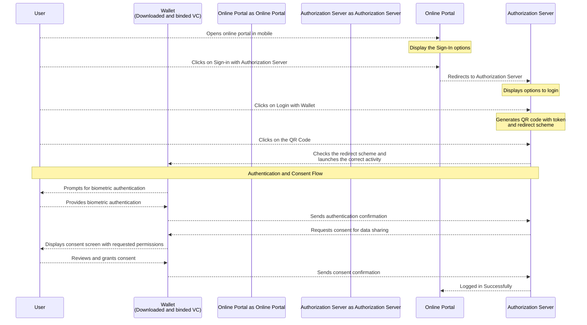

# WLA Auth

Inji Wallet enables seamless authentication to online portals using verifiable credentials. Through a QR code-based deep-linking technique, users can authenticate biometrically via their mobile wallet and securely grant data sharing permissions to access online services.

## Wallet Local Authentication - Sequence Diagram

Actors Involved

- Inji Wallet (Mobile App)
- User
- Authorization Server
- Online Portal

